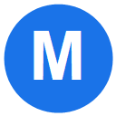

# New Tab Moein 🚀

<p align="center">
  
</p>

<p align="center">
  <b>A sleek, frosted-glass Google Homepage & New Tab customization extension for Google Chrome.</b><br>
  <i>Personalize your new tab with organized bookmark folders, drag-and-drop management, customizable color palettes, and smart offline support.</i>
</p>

<p align="center">
  <a href="README.fa.md"></a>
  <a href="README.md"></a>
</p>

<p align="center">
  
  
  
  
</p>

---

## 🌐 Languages / زبان‌ها

- [🇬🇧 **English (Current)**](README.md)
- [🇮🇷 **فارسی (Persian)**](README.fa.md)

---

## 🌟 Key Features

- 🎨 **Modern Frosted-Glass Aesthetics**: Elegant, transparent glassmorphism UI with smooth background blur (`backdrop-filter`) matching contemporary design systems.
- 🧭 **Unified Top Navigation Bar**: Combines the official Google multi-color logo on the right, the Google search bar in the center, and a 2x2 grid (Google Apps waffle menu, Account avatar, Gmail, Images) on the left into one balanced horizontal line.
- 📁 **Organized Bookmark Folders Grid**: Displays up to 12 customizable category folders (e.g. AI, Google Services, Social Media, Coding, University & Research) in a responsive 4-column grid.
- 🔀 **Full Drag-and-Drop Organization**:
  - Reorder folder cards effortlessly using the dedicated 6-dot grip handle (`⋮⋮`).
  - Reorder bookmark items inside any folder or move them across folders with intuitive visual drop indicators.
- 🎨 **Smart Color Wheel & Presets**: Customize the background tint of individual folder cards using an interactive HSL color wheel or soft pastel presets.
- 🌐 **Multi-Tier Smart Favicon Resolver**: Employs Chrome's official Manifest V3 `_favicon` API to pull directly from local browser cache (guaranteeing high-res icons even for domestic/banking and intranet `.ir` domains), backed by a 5-tier intelligent fallback chain (Google S2 full domain, subdomain-to-root resolution, DuckDuckGo, direct `/favicon.ico`, and SVG globe).
- 🔖 **Direct Chrome Bookmarks Import**: Seamlessly browse, select, and import your existing Google Chrome bookmarks and entire bookmark folders with one-click checkboxes.
- 📶 **Smart Offline Mode & Auto-Reconnection**:
  - Opens instantly even without an internet connection, loading all local bookmark folders and custom settings.
  - Displays a clean, native English status banner in the top search box: `No internet connection`.
  - Automatically probes connection every 2 seconds (with a strict 25-attempt limit) and redirects straight to Google once connectivity is restored.
  - Keeps the interface uncluttered without displaying retry counters or attempt numbers.
- 📐 **Adaptive & Scrollbar-Free Layout**: Automatically switches between 2-column and 3-column bookmark rows based on card width, and hides vertical scrollbars on cards whose bookmarks fit in two rows.

---

## 💻 Installation & Setup

1. Clone or download this repository:
   ```bash
   git clone https://github.com/moeindavarzani/New-Tab-Moein.git
   ```
2. Open **Google Chrome** and navigate to:
   ```text
   chrome://extensions
   ```
3. Enable **Developer mode** using the toggle switch in the top-right corner.
4. Click the **Load unpacked** button in the top-left.
5. Select the project folder (`New-Tab-Moein` or `Tab Moein`).
6. Open a new tab (`Ctrl + T`) to experience your customized Google homepage!

---

## 🏗️ Project Architecture

```text
New-Tab-Moein/
├── manifest.json       # Chrome Manifest V3 configuration (tabs, bookmarks, storage, webNavigation)
├── newtab.html         # New tab override page & offline UI container
├── redirect.js         # Intelligent online redirection / offline fallback controller
├── background.js       # Background service worker (Chrome bookmarks API & network error handler)
├── google_custom.js    # Core UI logic: grid rendering, modals, color picker, drag & drop, reconnect manager
├── google_custom.css   # Frosted glass styling, responsive layout, animations, custom scrollbars
├── icon128.png         # Official extension icon
├── test_logic.js       # Test suite runner & unit tests
└── test_runner.html    # Headless Chrome 25-stage automated DOM test suite
```

---

## 🧪 Automated Testing

Tab Moein includes comprehensive unit and headless browser DOM tests:

```bash
node test_logic.js
```

All 15 test suites—including 25 automated DOM tests executed inside Google Chrome Headless—pass with a 100% success rate.

---

## 📄 License

This project is licensed under the [MIT License](LICENSE).
